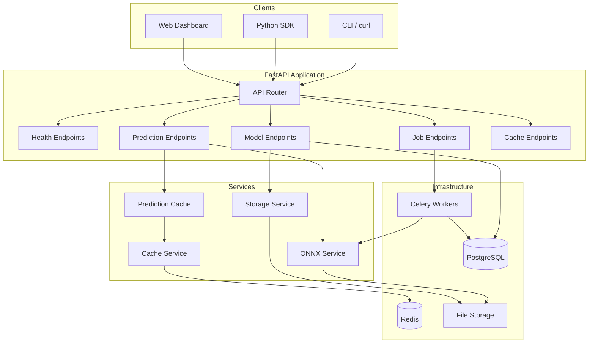
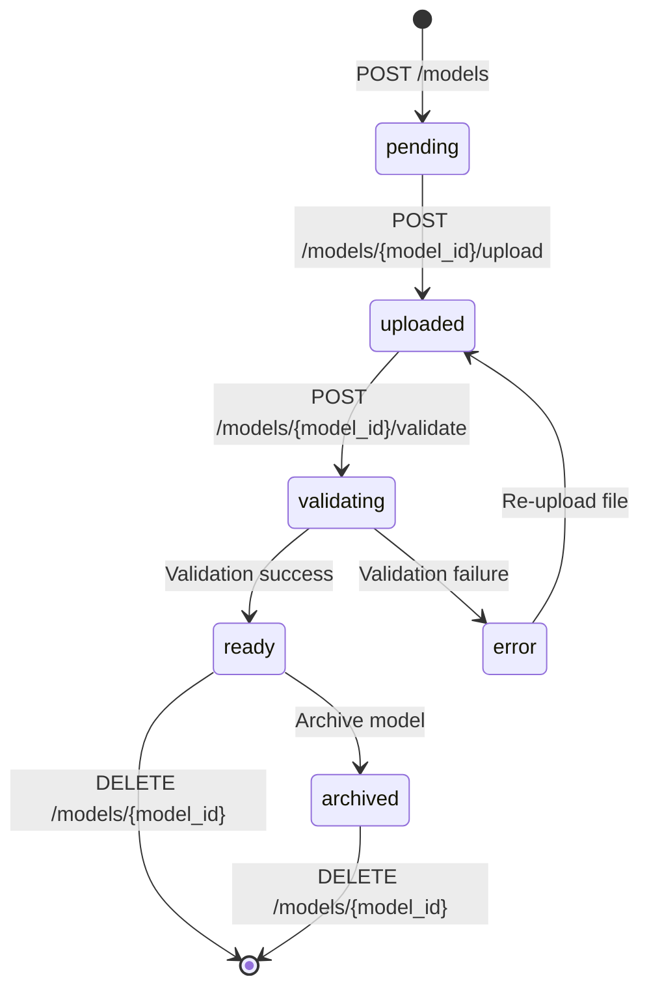
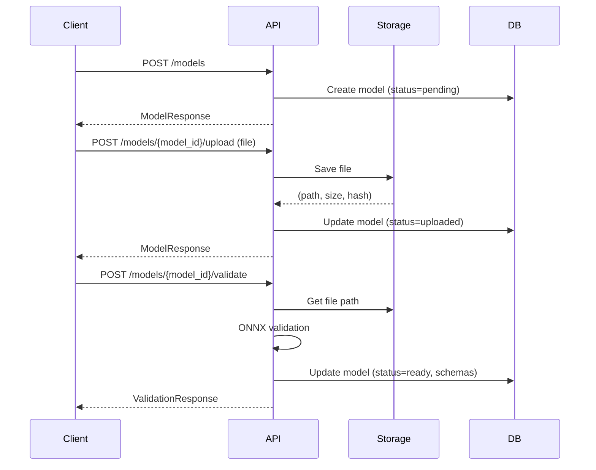

# ModelForge Architecture

This document describes the system architecture of ModelForge, a generic ONNX model serving platform.

## Architectural Philosophy

MLForge is designed for **practical ML infrastructure** — systems where models evolve, pipelines change, and certainty is earned over time rather than assumed upfront.

### What MLForge Does Not Guarantee

- **Global correctness**: Components make local decisions. There is no central arbiter.
- **Canonical context**: State is distributed. Consistency is eventual, not immediate.
- **Misuse prevention**: Invalid API call sequences are possible. They may fail late.
- **Refusal of all invalid states**: Some errors surface at runtime, not at request time.

These gaps are intentional. They reflect the reality of ML systems in development.

### The Pipeline Commitment Model

MLForge uses a conceptual **pipeline commitment boundary**:

1. **Before commitment** (status: PENDING, UPLOADED): Experimentation is allowed. Assumptions are mutable.
2. **At commitment** (validation → READY): Certain assumptions lock in.
3. **After commitment** (status: READY): Invariants are expected to hold.

This model exists in the design. Full enforcement is a work in progress.

### What MLForge Deliberately Avoids

- Plugin systems or registries
- Configuration layers added "for flexibility"
- Silent recovery or fallback mechanisms
- Abstractions designed for hypothetical future reuse

Complexity must be justified. If it isn't, it doesn't belong here.

### When to Use MLForge

You need to serve ONNX models with minimal ceremony, and you accept that:
- Some invalid states are possible
- Enforcement is explicit, not preventive
- Flexibility comes with operational responsibility

### When NOT to Use MLForge

- You need strict multi-tenant isolation
- You require schema enforcement at upload time
- You cannot tolerate late-surfacing errors

## System Overview



## Components

### API Layer

**FastAPI Application** (`app/main.py`)

The REST API provides endpoints organized by resource:

| Tag | Endpoints | Purpose |
|-----|-----------|---------|
| `health` | `/health`, `/ready`, `/live` | Kubernetes probes, service monitoring |
| `models` | `/models`, `/models/{model_id}`, `/models/{model_id}/upload`, `/models/{model_id}/validate` | ONNX model CRUD and lifecycle |
| `predictions` | `/models/{model_id}/predict`, `/models/{model_id}/predictions` | Synchronous inference |
| `jobs` | `/jobs`, `/jobs/{job_id}` | Async job queue management |
| `cache` | `/cache/metrics`, `/cache/metrics/reset` | Cache monitoring |

**Middleware Stack:**
1. CORS - Cross-origin resource sharing
2. Request Logging - Request ID injection, timing metrics

### Model Registry

**Database Models** (`app/models/`)

```
MLModel
├── id (UUID)
├── name, version
├── status (pending → uploaded → validating → ready / error / archived)
├── file_path (relative to storage root)
├── file_hash (SHA-256)
├── input_schema, output_schema (JSON)
└── model_metadata (JSON)

Prediction
├── id (UUID)
├── model_id (FK)
├── input_data, output_data (JSON)
├── inference_time_ms
├── cached (bool)
└── request_id, client_ip

Job
├── id (UUID)
├── model_id (FK)
├── status (pending → running → completed / failed)
├── input_data, output_data (JSON)
├── celery_task_id
├── queue_time_ms, inference_time_ms
└── error_message, error_traceback
```

**Model Lifecycle:**



### Pipeline Commitment Boundary

The `/models/{model_id}/validate` endpoint is **THE** commitment point in MLForge.
This is a one-way transition. There is no uncommit.

#### Pre-Boundary (PENDING, UPLOADED, VALIDATING, ERROR)

Before the boundary, models are experimental:

- Metadata may change freely
- Files may be re-uploaded
- No downstream operations depend on these models
- **Inference is blocked**

#### Post-Boundary (READY)

After validation succeeds, the following invariants lock in:

| Invariant | Meaning |
|-----------|---------|
| `file_path` is set | Points to a valid ONNX file |
| `file_hash` is set | Matches file content |
| `input_schema` is set | Describes model inputs authoritatively |
| `output_schema` is set | Describes model outputs authoritatively |
| `model_metadata` is set | Contains ONNX runtime metadata |
| File is loadable | ONNX Runtime can load it without error |

**Post-boundary code assumes these invariants hold.** If they do not, the system is in a corrupt state. Violations are treated as corruption, not expected failures.

#### Boundary in Code

- **Commitment point**: `validate_model()` in `app/api/models.py`
- **Boundary check**: `model.assert_committed()` in `app/models/ml_model.py`
- **Post-boundary modules**: `app/api/predictions.py`, `app/tasks/inference.py`

Post-boundary code calls `model.assert_committed()` as its first operation.
This makes the boundary crossing explicit rather than relying on implicit status checks.

#### Why This Matters

If you try to run inference on an UPLOADED model, the error message explicitly says "has not crossed the pipeline commitment boundary" rather than a generic "not ready" message.

This is intentionally **not** a global canonical context. Each model commits independently.

### Deliberate Failure Modes

MLForge includes intentional, non-recoverable failure modes. These are not errors to be handled. They are statements that the pipeline is in a state that must not exist.

#### PostCommitmentInvariantViolation

**Location**: `app/services/onnx.py`

**Violated Invariant**: After commitment, `file_path` points to a valid, loadable ONNX file.

**Observed State**: A committed model's file no longer exists on disk.

**What Happens**:
1. Exception is raised
2. Execution stops
3. The exception propagates without being caught

**What Does NOT Happen**:
- No retry
- No fallback
- No silent reload from a different path
- No graceful degradation
- No wrapping in a "friendlier" error

**Why Stopping Is Correct**:

The commitment boundary guarantees that post-boundary code may rely on certain invariants. If those invariants do not hold, continuing would mean operating on assumptions known to be false. The system refuses.

This is not about "something went wrong." This is about the pipeline contract being violated. The only honest response is to stop.

**Code path**:
```
get_cached_session() → file missing → raises PostCommitmentInvariantViolation
  → predictions.py → raise (not caught) → execution stops
```

If you are tempted to catch this exception and continue, ask: "Why is it acceptable to proceed when the pipeline's contract is known to be broken?"

### Decision Authority

MLForge separates **decisions** (whether to proceed) from **execution** (how to proceed).

#### Code Structure

Orchestration code (`predictions.py`, `inference.py`) is structured in phases:

```
PHASE 1: DECISIONS
  - All decisions are made here
  - Each decision is named and explicit
  - Decision authority is documented

PHASE 2: EXECUTION
  - Decisions have been made
  - Execute based on those decisions
  - Execution code makes NO policy decisions

PHASE 3: RECORD (if applicable)
  - Record results
```

#### Decision Table

| Decision | Authority | Location |
|----------|-----------|----------|
| Is model committed? | Pipeline commitment boundary | predictions.py, inference.py |
| Does file_path exist? | Post-commitment invariant | predictions.py, inference.py |
| Use cached result? | Caller (skip_cache param) | predictions.py |
| Is path safe? | Security policy | inference.py |

#### Execution Code Has No Decisions

**ONNXService.run_inference()** is pure execution:
- Takes path and input data
- Returns results
- Makes no decisions about whether to proceed
- Contains no policy logic

If you find yourself wanting ONNXService to "decide" something, that decision belongs in the calling code.

#### Adding Policy Requires Visible Changes

To add:
- Retries: Add a DECISION in orchestration code
- Fallbacks: Add a DECISION in orchestration code
- Confidence thresholds: Add a DECISION in orchestration code

You cannot add policy by modifying ONNXService. That is intentional.

Policy changes should be visible at the orchestration level, not hidden in execution code.

### Inference Engine

**ONNX Service** (`app/services/onnx.py`)

Handles all ONNX Runtime operations:

- **Validation**: Load model, extract input/output schemas, metadata
- **Session Caching**: In-memory cache of loaded ONNX sessions
- **Inference**: Run predictions with automatic dtype conversion
- **Error Handling**: Typed exceptions (ONNXLoadError, ONNXInputError, ONNXInferenceError)

```python
# Session cache structure
_session_cache: dict[str, tuple[InferenceSession, list[str], list[str]]]
#              path -> (session, input_names, output_names)
```

### Cache Layer

**Cache Service** (`app/services/cache.py`)

Redis wrapper with graceful degradation:

- Connects to Redis on startup (non-blocking failure)
- All operations return safe defaults on error (None, False, 0)
- JSON serialization for complex values
- Key namespacing via configurable prefix

**Prediction Cache** (`app/services/prediction_cache.py`)

Higher-level caching for inference results:

```
Cache Key Pattern: prediction:{model_id}:{input_hash}

input_hash = MD5(JSON(input_data, sorted_keys=True))[:16]
```

Features:
- TTL-based expiration (default: 60 seconds)
- Hit/miss metrics tracking
- Model-level invalidation on re-upload
- `skip_cache` parameter for fresh inference

### Storage Layer

**Storage Service** (`app/services/storage.py`)

Abstract interface with local filesystem implementation:

```python
class StorageService(ABC):
    async def save(file, filename, max_size_bytes) -> (path, size, hash)
    async def get(path) -> bytes
    async def delete(path) -> bool
    async def exists(path) -> bool
    async def get_path(path) -> Path
```

Security:
- Filename sanitization (strips directory components)
- Path traversal protection (`is_relative_to` check)
- Size limits enforced during upload

### Job Queue

**Celery Workers** (`app/tasks/inference.py`)

Async inference for long-running predictions:

```python
@celery_app.task(
    max_retries=3,
    soft_time_limit=300,  # 5 min soft limit
    time_limit=600,       # 10 min hard kill
    retry_backoff=True,
    retry_jitter=True,
)
def run_inference_task(job_id: str):
    # 1. Update job status to RUNNING
    # 2. Load model and run inference
    # 3. Update job with results or error
```

Retry behavior:
- Exponential backoff with jitter
- ONNX errors are permanent (no retry)
- Infrastructure errors retry up to max_retries

## Data Flow

### Synchronous Prediction


### Async Job Processing


### Model Upload Flow



## Configuration

Key settings from `app/config.py`:

| Setting | Default | Description |
|---------|---------|-------------|
| `database_url` | postgresql+asyncpg://... | PostgreSQL connection |
| `redis_url` | redis://localhost:6379/0 | Redis connection |
| `model_storage_path` | ./models | Local file storage path |
| `max_model_size_mb` | 500 | Maximum ONNX file size |
| `cache_prediction_ttl` | 60 | Prediction cache TTL (seconds) |
| `celery_task_soft_time_limit` | 300 | Soft timeout for async tasks |
| `celery_task_time_limit` | 600 | Hard timeout for async tasks |
| `job_max_retries` | 3 | Max retry attempts |

## Error Handling

### API Errors

| HTTP Status | Meaning |
|-------------|---------|
| 400 | Invalid input, model not ready, validation failure |
| 404 | Model or job not found |
| 500 | Storage error, inference failure, internal error |

### Graceful Degradation

- **Redis unavailable**: Cache operations return safe defaults, predictions still work
- **Storage unavailable**: Upload/inference fails with clear error message
- **Celery unavailable**: Async jobs fail to enqueue, sync predictions unaffected

## Security Considerations

1. **Path Traversal**: All file paths sanitized and validated against base directory
2. **Input Validation**: Pydantic schemas validate all API inputs
3. **No Authentication**: Designed for internal/VPN deployment; add auth at gateway
4. **CORS**: Configurable allowed origins
5. **Sentry Integration**: Optional error tracking for production
