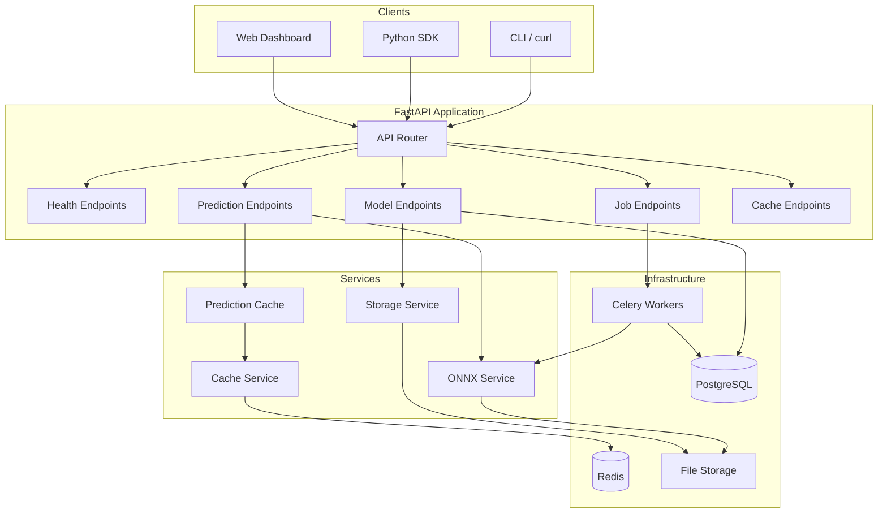
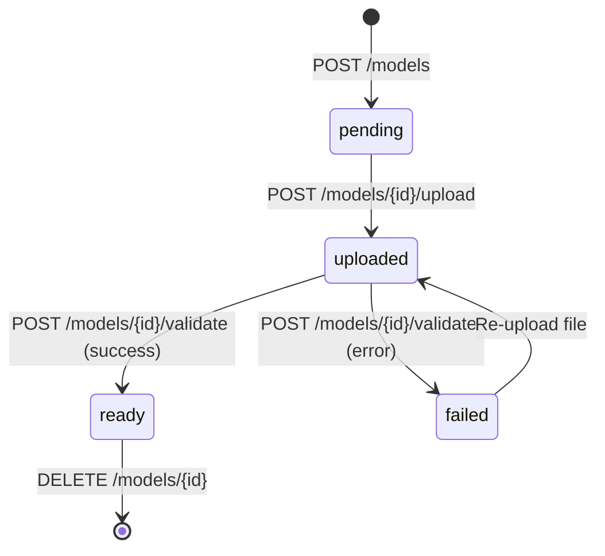
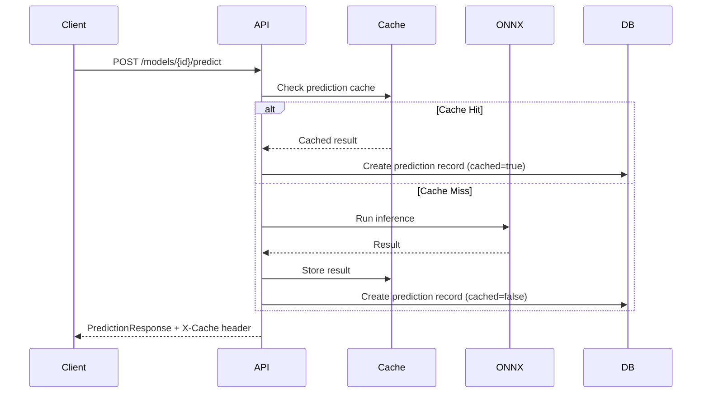
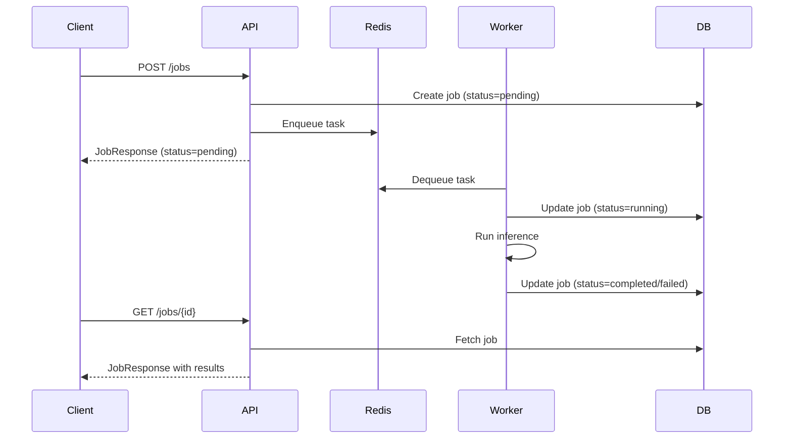
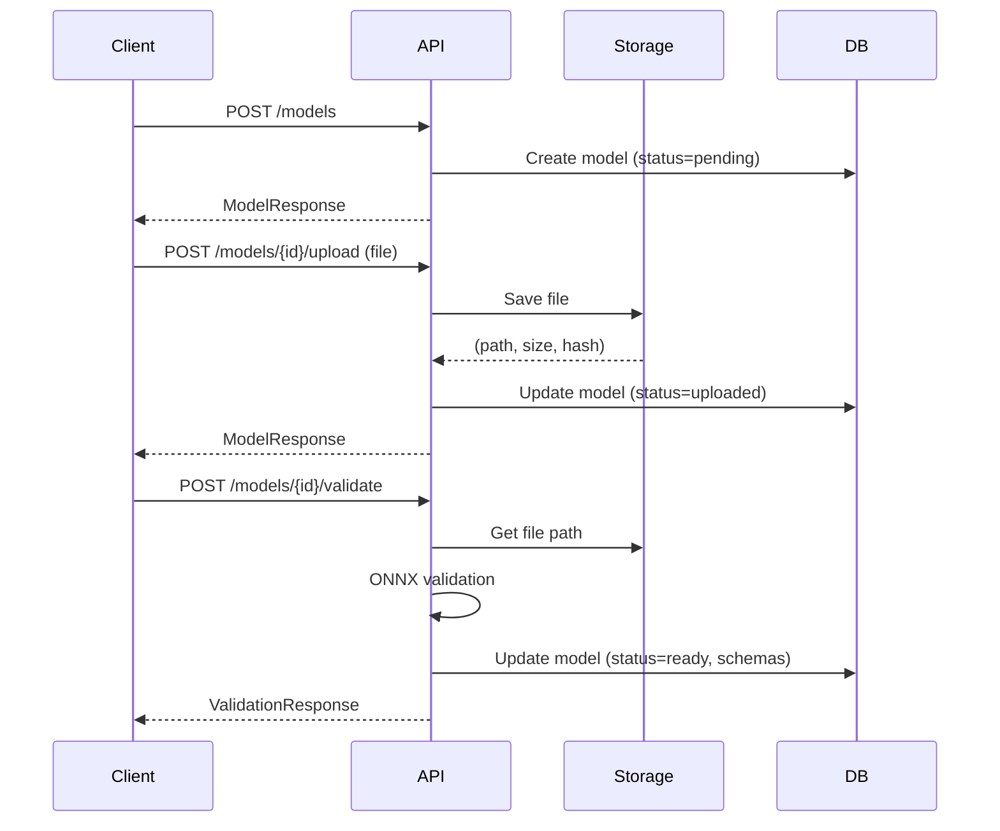

# MLForge Architecture

This document describes the system architecture of MLForge, a generic ONNX model serving platform.

## System Overview



## Components

### API Layer

**FastAPI Application** (`app/main.py`)

The REST API provides endpoints organized by resource:

| Tag | Endpoints | Purpose |
|-----|-----------|---------|
| `health` | `/health`, `/health/ready`, `/health/live` | Kubernetes probes, service monitoring |
| `models` | `/models`, `/models/{id}`, `/models/{id}/upload`, `/models/{id}/validate` | ONNX model CRUD and lifecycle |
| `predictions` | `/models/{id}/predict`, `/models/{id}/predictions` | Synchronous inference |
| `jobs` | `/jobs`, `/jobs/{id}` | Async job queue management |
| `cache` | `/cache/metrics`, `/cache/metrics/reset` | Cache monitoring |

**Middleware Stack:**
1. CORS - Cross-origin resource sharing
2. Request Logging - Request ID injection, timing metrics

### Model Registry

**Database Models** (`app/models/`)

```
MLModel
├── id (UUID)
├── name, version
├── status (pending → uploaded → ready / failed)
├── file_path (relative to storage root)
├── file_hash (SHA-256)
├── input_schema, output_schema (JSON)
└── metadata (JSON)

Prediction
├── id (UUID)
├── model_id (FK)
├── input_data, output_data (JSON)
├── inference_time_ms
├── cached (bool)
└── request_id, client_ip

Job
├── id (UUID)
├── model_id (FK)
├── status (pending → running → completed / failed)
├── input_data, output_data (JSON)
├── celery_task_id
├── queue_time_ms, inference_time_ms
└── error_message, error_traceback
```

**Model Lifecycle:**



### Inference Engine

**ONNX Service** (`app/services/onnx.py`)

Handles all ONNX Runtime operations:

- **Validation**: Load model, extract input/output schemas, metadata
- **Session Caching**: In-memory cache of loaded ONNX sessions
- **Inference**: Run predictions with automatic dtype conversion
- **Error Handling**: Typed exceptions (ONNXLoadError, ONNXInputError, ONNXInferenceError)

```python
# Session cache structure
_session_cache: dict[str, tuple[InferenceSession, list[str], list[str]]]
#              path -> (session, input_names, output_names)
```

### Cache Layer

**Cache Service** (`app/services/cache.py`)

Redis wrapper with graceful degradation:

- Connects to Redis on startup (non-blocking failure)
- All operations return safe defaults on error (None, False, 0)
- JSON serialization for complex values
- Key namespacing via configurable prefix

**Prediction Cache** (`app/services/prediction_cache.py`)

Higher-level caching for inference results:

```
Cache Key Pattern: prediction:{model_id}:{input_hash}

input_hash = MD5(JSON(input_data, sorted_keys=True))[:16]
```

Features:
- TTL-based expiration (default: 60 seconds)
- Hit/miss metrics tracking
- Model-level invalidation on re-upload
- `skip_cache` parameter for fresh inference

### Storage Layer

**Storage Service** (`app/services/storage.py`)

Abstract interface with local filesystem implementation:

```python
class StorageService(ABC):
    async def save(file, filename, max_size_bytes) -> (path, size, hash)
    async def get(path) -> bytes
    async def delete(path) -> bool
    async def exists(path) -> bool
    async def get_path(path) -> Path
```

Security:
- Filename sanitization (strips directory components)
- Path traversal protection (`is_relative_to` check)
- Size limits enforced during upload

### Job Queue

**Celery Workers** (`app/tasks/inference.py`)

Async inference for long-running predictions:

```python
@celery_app.task(
    max_retries=3,
    soft_time_limit=300,  # 5 min soft limit
    time_limit=600,       # 10 min hard kill
    retry_backoff=True,
    retry_jitter=True,
)
def run_inference_task(job_id: str):
    # 1. Update job status to RUNNING
    # 2. Load model and run inference
    # 3. Update job with results or error
```

Retry behavior:
- Exponential backoff with jitter
- ONNX errors are permanent (no retry)
- Infrastructure errors retry up to max_retries

## Data Flow

### Synchronous Prediction



### Async Job Processing



### Model Upload Flow



## Configuration

Key settings from `app/config.py`:

| Setting | Default | Description |
|---------|---------|-------------|
| `database_url` | postgresql+asyncpg://... | PostgreSQL connection |
| `redis_url` | redis://localhost:6379/0 | Redis connection |
| `model_storage_path` | ./models | Local file storage path |
| `max_model_size_mb` | 500 | Maximum ONNX file size |
| `cache_prediction_ttl` | 60 | Prediction cache TTL (seconds) |
| `celery_task_soft_time_limit` | 300 | Soft timeout for async tasks |
| `celery_task_time_limit` | 600 | Hard timeout for async tasks |
| `job_max_retries` | 3 | Max retry attempts |

## Error Handling

### API Errors

| HTTP Status | Meaning |
|-------------|---------|
| 400 | Invalid input, model not ready, validation failure |
| 404 | Model or job not found |
| 500 | Storage error, inference failure, internal error |

### Graceful Degradation

- **Redis unavailable**: Cache operations return safe defaults, predictions still work
- **Storage unavailable**: Upload/inference fails with clear error message
- **Celery unavailable**: Async jobs fail to enqueue, sync predictions unaffected

## Security Considerations

1. **Path Traversal**: All file paths sanitized and validated against base directory
2. **Input Validation**: Pydantic schemas validate all API inputs
3. **No Authentication**: Designed for internal/VPN deployment; add auth at gateway
4. **CORS**: Configurable allowed origins
5. **Sentry Integration**: Optional error tracking for production
